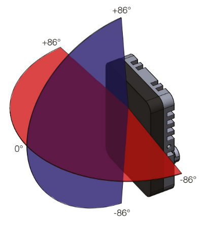

# ROS2 Driver for RFbeam V-MD3 Radar Transceiver

[](https://github.com/labforge/v-md3-ros2/actions/workflows/ci.yml)

See [here](https://rfbeam.ch/product/v-md3-radar-transceiver/).



The radar provides raw target data and speed as well as tracking data for identified targets. The sensor itself does
not publish timestamps, so the driver adds timestamps upon receiving the data.

Raw returns are is expressed as `TDAT` packet and tracked targets as `PDAT` packet. Both packets contain the following
data rows.

| Field                 | Type     | Description            |
|-----------------------|----------|------------------------|
| Distance (cm)         | `uint16` | Distance to the target |
| Speed (km/h) * 100    | `int16`  | Relative speed         |
| Azimuth (deg) * 100   | `int16`  | Horizontal angle       |
| Elevation (deg) * 100 | `int16`  | Vertical angle         |
| Magnitude             | `uint16` | Signal strength        |
| Doppler Velocity      | `uint16` | Velocity in km/h       |

The radar can be configured into the following modes.

| # | Mode                    | Description                                                             |
|---|-------------------------|-------------------------------------------------------------------------|
| 0 | 2D, 6m, 10km/h 128/64   | 2D mode, 6m range, 10km/h speed, 128 raw returns, 64 tracked targets    |
| 1 | 2D, 10m, 10km/h 128/64  | 2D mode, 10m range, 10km/h speed, 128 raw returns, 64 tracked targets   |
| 2 | 2D, 30m, 30km/h 128/64  | 2D mode, 30m range, 30km/h speed, 128 raw returns, 64 tracked targets   |
| 3 | 2D, 30m, 50km/h 128/64  | 2D mode, 30m range, 50km/h speed, 128 raw returns, 64 tracked targets   |
| 4 | 2D, 50m, 50km/h 128/64  | 2D mode, 50m range, 50km/h speed, 128 raw returns, 64 tracked targets   |
| 5 | 2D, 100m, 100km/h 128/64| 2D mode, 100m range, 100km/h speed, 128 raw returns, 64 tracked targets |
| 6 | 3D, 6m, 10km/h 128/64   | 3D mode, 6m range, 10km/h speed, 128 raw returns, 64 tracked targets    |
| 7 | 3D, 10m, 10km/h 128/64  | 3D mode, 10m range, 10km/h speed, 128 raw returns, 64 tracked targets   |
| 8 | 3D, 30m, 30km/h 128/64  | 3D mode, 30m range, 30km/h speed, 128 raw returns, 64 tracked targets   |

Note for `2D` modes the returned elevation angle is always `0`.

## Raw Detection

The radar can be configured to detect raw returns with a configurable sensitivity in the range of `0` (lowest) to `15` (highest).
Detections can be further filtered by a range of minimum and maximum distance as well as minimum and maximum speed, expressed
as percentage of the above setting.

## Target Detection

The target can be configured to recognize and track targets with a configurable radar lifetime in the range of 
`0` (shortest) to `100` (longest) frames. Stationary detected targets can be included or excluded from the tracking.

## Parameters

The driver supports the following parameters for configuration. Note use the RFbeam V-MD3 utility to configure the 
radar sensors `address` and `port` prior to running the driver. The exported parameters can be set via the launch file
or `rqt_reconfigure` if the connection fails (they will only be applied on the successful restart of the driver).

| Parameter Name | Type     | Description                                       | Default Value     |
|----------------|----------|---------------------------------------------------|-------------------|
| `address`      | `string` | IP address of the radar sensor                    | `192.168.100.201` |
| `port`         | `int`    | TCP port of the radar sensor command interface    | `6172`            |
| `rport`        | `int`    | UDP port of the listener for radar responses      | `4567`            |
| `mode`         | `int`    | Sets the radar operation mode (0-8)               | `0`               |
| `sensitivity`  | `int`    | Sets the raw detection sensitivity (0-15)         | `5`               |
| `min_distance` | `int`    | Sets the minimum detection distance (0-100%)      | `0`               |
| `max_distance` | `int`    | Sets the maximum detection distance (0-100%)      | `100`             |
| `min_speed`    | `int`    | Sets the minimum detection speed (0-100%)         | `0`               |
| `max_speed`    | `int`    | Sets the maximum detection speed (0-100%)         | `100`             |
| `min_lifetime` | `int`    | Sets the minimum target tracking lifetime (0-100) | `5`               |
| `max_lifetime` | `int`    | Sets the maximum target tracking lifetime (0-100) | `100`             |
| `stationary`   | `bool`   | Include stationary targets in tracking            | `false`           |

## Published Topics
The driver publishes the following topics:

 * `detections` ([RadarScan](https://github.com/ros-perception/radar_msgs/blob/ros2/msg/RadarScan.msg)): Publishes the raw radar scan data (if enabled).
 * `targets` ([RadarScan](https://github.com/ros-perception/radar_msgs/blob/ros2/msg/RadarScan.msg)): Publishes the target scan data (if enabled).
 * `detections_pcl` ([PointCloud2](https://docs.ros.org/en/humble/p/sensor_msgs/msg/PointCloud2.html)): Converts the raw radar scan data to point cloud format (if enabled).
 * `targets_pcl` ([PointCloud2](https://docs.ros.org/en/humble/p/sensor_msgs/msg/PointCloud2.html)): Converts the target scan data to point cloud format (if enabled)
 * `status` ([std_msgs/String](https://docs.ros.org/en/humble/api/std_msgs/msg/String.html)): Publishes status messages from the radar driver.

As soon as a valid connection to the radar sensor is established, the driver starts publishing the radar data, or update
the status topic in case of errors.

## Requirements
 * ROS2 or newer
   * tested with [ROS2 Humble](https://docs.ros.org/en/foxy/Releases/Release-Humble-Hawksbill.html)
 * [rospy](https://wiki.ros.org/rospy)
 * [V-MD3 Radar Sensor](https://rfbeam.ch/product/v-md3-radar-transceiver/)

## Installation

 * Install your ROS2 [Humble](https://docs.ros.org/en/humble/Installation.html) environment
 * Create a ROS2 [workspace](https://docs.ros.org/en/humble/Tutorials/Beginner-Client-Libraries/Creating-A-Workspace/Creating-A-Workspace.html)
 * Install the required dependencies
```bash
# Install the dependencies
source /opt/ros/humble/setup.sh
rosdep update --include-eol-distros
rosdep install -i --from-path src --rosdistro humble -y
```
 * If the above fails, ensure you have a minimal `ROS2` environment installed
```bash
sudo apt update
sudo apt install -y curl gnupg2 lsb-release
sudo curl -sSL https://raw.githubusercontent.com/ros/rosdistro/master/ros.key | sudo apt-key add -
sudo sh -c 'echo "deb [arch=amd64] http://packages.ros.org/ros2/ubuntu $(lsb_release -cs) main" > /etc/apt/sources.list.d/ros2-latest.list'
sudo apt update 
sudo apt install -y python3-colcon-common-extensions \
     python-is-python3 \
     python3-numpy \
     python3-rosdep \
     python3-rosdep2 \
     ros-humble-cv-bridge \
     ros-humble-rclcpp-components \
     ros-humble-rclpy \
     ros-humble-std-msgs \
     ros-humble-radar-msgs \
     ros-humble-sensor-msgs \
     ros-humble-vision-msgs \
     ros-humble-visualization-msgs \
     ros-humble-image-transport \
     ros-humble-camera-calibration-parsers \
     ros-humble-camera-info-manager \
     ros-humble-launch-ros \
     ros-humble-image-transport \
     ros-humble-image-transport-plugins \
     ros-humble-image-view \
     build-essential libopencv-dev locales \
     software-properties-common \
     libcurl4-openssl-dev  
```
 * Clone this repository into the `src` folder of your workspace and then build the workspace
```bash
# verbose build
colcon build --event-handlers console_direct+ --symlink-install
# resource the installed workspace
source install/local_setup.sh
# Run the driver with default arguments
ros2 run vmd3_radar_driver driver
# or via launch file (edit as needed)
ros2 launch vmd3_radar_driver vmd3_radar_driver_launch.py
